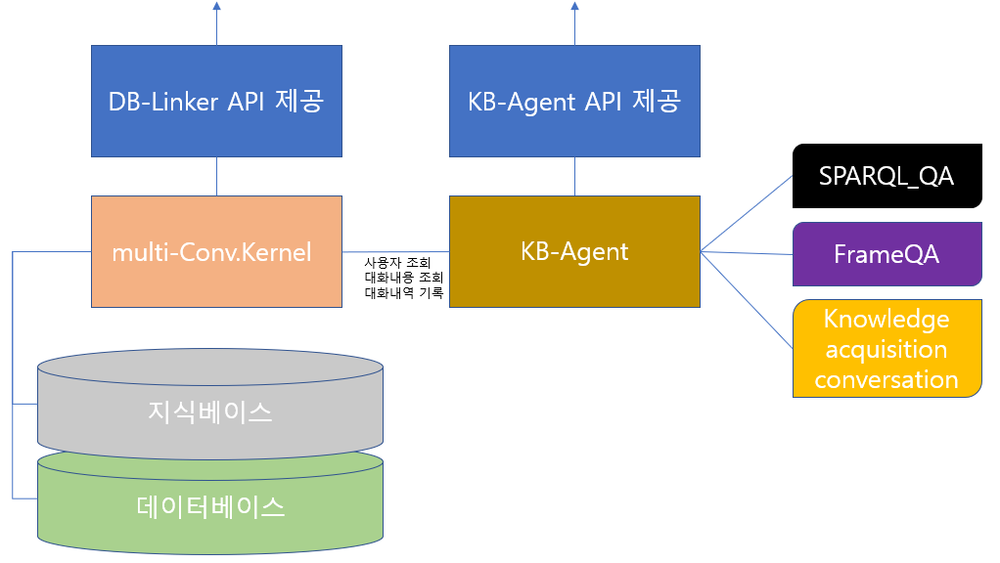
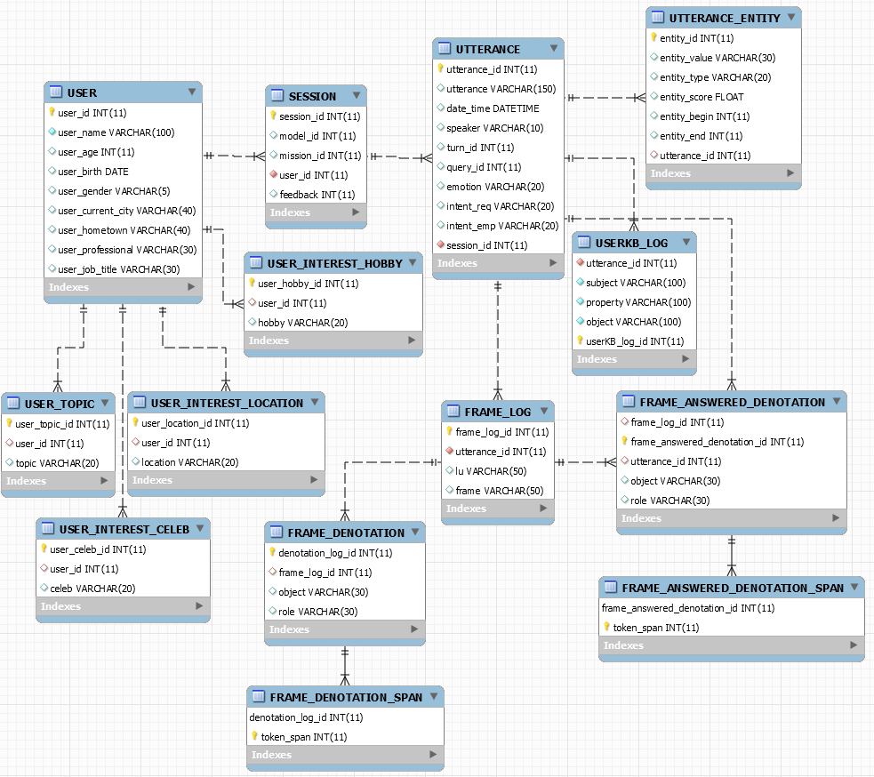

# Flagship 5차년도 KB-Agent Readme

버전: 0.9
작성자: 정용빈

***

#### Note

* (2020/05/30) 5월 마스터 버전이 업데이트 되었습니다.
* (2020/07/16) 설치 방법이 업데이트 되었습니다.
* (2020/11/03) API 수정사항 반영
* (2020/11/08) database 설치방법 추가

***

#### System/SW Overview

* 대화 모듈의 대화 흐름및 대화에 필요한 다양한 정보들을 사용자별로 기록 할 수 있는 데이터베이스 및 지식베이스 구성

* 데이터베이스에 사용자별 정보 기록 및 불러오기를 할 수 있는 모듈 제공(multi-Conv.Kernel)

* 데이터베이스 및 지식베이스를 활용한 대화 모듈 제공

  * SPARQLQA(KGQA) - 지식베이스를 활용하여 사용자의 일반지식 질문에 대하여 답변
  * Fact checking QA - 사용자가 묻는 Ask에 대해 참과 거짓을 답하고, 그에 대한 근거를 제시함
  * FrameQA - Frame parser를 이용하여 사용자와의 대화에서 빠진 정보를 파악하여 사용자에게 질문
  * Knowledge acquisition conversation - 지금 대화 주제와 관련해 지식베이스에 존재하지 않는 지식에 대해 사용자에게 질문

* KB-Agent: multi-Conv.Kernel을 이용하여 사용자 조회 및 사용자의 과거 대화내용을 활용하여 어떤 대화 모듈을 선택할것인지 결정 등을 하는 채팅 모듈

* multi-Conv.Kernel: 지식베이스 및 데이터베이스에 접근 할 수 있는 다양한 기능 제공

  
  
###### 전체 시스템  



###### RDB ER 다이어그램


***

#### How to Install

* Database install
  * backup.tar.gz를 host의 적절한 공간에 압축을 해제한다. (예를들면 /var/mysql)
  * 아래와 같이 docker로 mysql을 여는데, 위에서 해제한 데이터를 mounting 한다.
```(bash)
docker run -d -p 9876:3306 --name kbagent_mysql -v /var/mysql:/var/lib/mysql -e MYSQL_ROOT_PASSWORD=password mysql:5.6
```


* conda를 이용하여 python package를 설치한다.
  * 실행하기 전에 파일 내에 prefix를 수정한다. 
    * ex>  prefix: C:\Users\\[사용자이름] \Anaconda3\envs\\[가상환경이름]
  * 실행 할 때, Solving environment: failed ResolvePackageNotFound: 와 같은 error가 뜬다면, 실험실 환경이 달라 라이브러리를 설치 할 수 없는 것이 포함돼 있기 때문인데, 해결 방법은 수동으로 ResoevePackageNotFound 에서 출력된 리스트를 environment.yaml 파일에서 지운 후, 다시 시도하면 된다. 
* KB-agent\KB_Agent\modules\constant.py 파일에 절대경로를 설치 환경에 맞게 설정한다.
```(bash)
conda env create --file conda-environment.yaml (./KB_Agent/)
```

***

#### Main requirement

> * python 3.7.6
> * pymysql 0.9.3
> * flask

***

#### Network Architecture and features

* SPARQL QA에 대해 업로드 예정

***

#### Quick start

> * Step0. Conda를 actication 한 뒤 DB_linker 및 KB_Agent에 있는 app.py를 각각 실행하여 API를 open한다.
> ```
> conda activate {ENV_NAME}
> python3 app.py (..../DB_linker/app.py)
> python3 app.py (..../KB_Agent/app.py)
> ```
>
> * Step1. Postman과 같은 tool을 이용하여 각 API를 호출한다.
> ```
> /respond_to_user_utterance
> {
> 	"user_id": "59",
> 	"user_name": null,
> 	"user_utterance": "나는 독일에서 지냈어",
> 	"session_id": null,
> 	"modules": ["sparql_qa", "frame_qa", "kowledge_acquire"]
> }
> ```
>
> * Step2. response된 결과를 확인한다.
>
> ```
> {
>     "answer": "누구와 지냈나요?"
> }
> ```

***

#### HTTP-server API description

* **DB_Linker(multi-Conv.Kernel)**

> *  /AddUserInfo
> *  JSON parameters are:
>
> | Parameter         | Type                | Description                   |
> | ----------------- | ------------------- | ----------------------------- |
> | *user_num         | int                 | user login account            |
> | user_name         | string              | user name                     |
> | user_age          | num                 | user age                      |
> | user_birth        | datetime            | user birth date               |
> | user_gender       | string, one of enum | one of ["M","F"], user gender |
> | user_current_city | string              | user current city             |
> | user_hometown     | string              | user hometown                 |
> | user_professional | string              | user professional             |
> | user_job_title    | string              | user job name                 |
> | personality_E     | int                 | result of user BIG5           |
> | personality_N     | int                 | result of user BIG5           |
> | personality_C     | int                 | result of user BIG5           |
> | personality_A     | int                 | result of user BIG5           |
> | personality_O     | int                 | result of user BIG5           |
>
> * Request
>

> ```
> POST /AddUserInfo
> data: {
> 	"user_num": 15,
> 	"user_name":"정용빈",
> 	"user_age":null,
> 	"user_birth":"1994-03-18",
> 	"user_gender":"M",
> 	"user_current_city":null,
> 	"user_hometown":"Jinju",
> 	"user_professional":"NLP",
> 	"user_job_title":"Student",
> 	"personality_E":5,
> 	"personality_N":3,
> 	"personality_C":1,
> 	"personality_A":4,
> 	"personality_O":null
> }
> ```

> * Response OK (생성된 user의 정보를 반환)
>
> ```
> 200 OK
> {
>     "USER_INTEREST_CELEB": [],
>     "USER_INTEREST_HOBBY": [],
>     "USER_INTEREST_LOCATION": [],
>     "USER_TOPIC": [],
>     "personality_A": 4,
>     "personality_C": 1,
>     "personality_E": 5,
>     "personality_N": 3,
>     "personality_O": null,
>     "user_account": "test_new_user",
>     "user_age": null,
>     "user_birth": "Fri, 18 Mar 1994 00:00:00 GMT",
>     "user_current_city": null,
>     "user_gender": "M",
>     "user_hometown": "Jinju",
>     "user_id": 93,
>     "user_job_title": "Student",
>     "user_name": "정용빈",
>     "user_professional": "NLP"
> }
> ```

> 

> *  /AddUserListInfo
> * JSON parameters are:
> * user_id 혹은 user_account를 입력

> |Parameter|Type|Description|
> |---|---|---|
> |*user_id|num|id of user in table USER (key) to refer|
> |*user_num|int|user login account|
> |user_interest_celeb|list of strings|celebs to add in user information|
> |user_interest_hobby|list of strings|hobbies to add in user information|
> |user_interest_location|list of strings|locations to add in user information|
> |user_topic|list of strings|topics to add in user information|

> * Request
> ```
> POST /AddUserListInfo
> data: {
> 	"user_id":null,
> 	"user_num":15,
> 	"user_interest_celeb":["IU"],
> 	"user_interest_hobby":["soccer", "baseball"],
> 	"user_interest_location":["Jinju", "Roma"],
> 	"user_topic":["computer", "NLP"]
> }
> ```

> * Response OK (변경후 user의 정보를 반환)
> ```
> 200 OK
> {
>     "USER_INTEREST_CELEB": [
>         "IU"
>     ],
>     "USER_INTEREST_HOBBY": [
>         "soccer",
>         "baseball"
>     ],
>     "USER_INTEREST_LOCATION": [
>         "Jinju",
>         "Roma"
>     ],
>     "USER_TOPIC": [
>         "computer",
>         "NLP"
>     ],
>     "personality_A": 4,
>     "personality_C": 1,
>     "personality_E": 5,
>     "personality_N": 3,
>     "personality_O": null,
>     "user_account": "test_new_user",
>     "user_age": null,
>     "user_birth": "Fri, 18 Mar 1994 00:00:00 GMT",
>     "user_current_city": null,
>     "user_gender": "M",
>     "user_hometown": "Jinju",
>     "user_id": 93,
>     "user_job_title": "Student",
>     "user_name": "정용빈",
>     "user_professional": "NLP"
> }
> ```


> *  /UpdateUserListInfo
> * JSON parameters are:
> * user_id 혹은 user_account를 입력

> |Parameter|Type|Description|
> |---|---|---|
> |*user_id|num|id of user in table USER (key) to refer|
> |*user_num|int|user login account|
> |user_interest_celeb|list of strings|celebs to add in user information|
> |user_interest_hobby|list of strings|hobbies to add in user information|
> |user_interest_location|list of strings|locations to add in user information|
> |user_topic|list of strings|topics to add in user information|

> * Request
> ```
> POST /UpdateUserListInfo
> data: {
> 	"user_id":null,
> 	"user_num":15,
> 	"user_interest_celeb":["IU"],
> 	"user_interest_hobby":["soccer", "baseball"],
> 	"user_interest_location":["Jinju", "Roma"],
> 	"user_topic":["computer"]
> }
> ```

> * Response OK (변경후 user의 정보를 반환)
> ```
> 200 OK
> {
>        "USER_INTEREST_CELEB": [
>            "IU"
>        ],
>        "USER_INTEREST_HOBBY": [
>            "soccer",
>            "baseball"
>        ],
>        "USER_INTEREST_LOCATION": [
>            "Jinju",
>            "Roma"
>        ],
>        "USER_TOPIC": [
>            "computer"
>        ],
>        "personality_A": 4,
>        "personality_C": 1,
>        "personality_E": 5,
>        "personality_N": 3,
>        "personality_O": null,
>        "user_account": "test_new_user",
>        "user_age": null,
>        "user_birth": "Fri, 18 Mar 1994 00:00:00 GMT",
>        "user_current_city": null,
>        "user_gender": "M",
>        "user_hometown": "Jinju",
>        "user_id": 93,
>        "user_job_title": "Student",
>        "user_name": "정용빈",
>        "user_professional": "Computer"
>    }
> ```


> 
>
> *  /DeleteUserListInfo
> *  JSON parameters are:

> | Parameter              | Type            | Description                             |
> | ---------------------- | --------------- | --------------------------------------- |
> | *user_id               | num             | id of user in table USER (key) to refer |
> | *user_account               | string             | user login account |
> | user_interest_celeb    | list of strings | celebs to delete in user information    |
> | user_interest_hobby    | list of strings | hobbies to delete in user information   |
> | user_interest_location | list of strings | locations to delete in user information |
> | user_topic             | list of strings | topics to delete in user information    |

> * Request
>
> ```
> POST /DeleteUserListInfo
> data: {
> 	"user_id":null,
> 	"user_num": 15,
> 	"user_interest_celeb":["IU"],
> 	"user_interest_hobby":["baseball"],
> 	"user_interest_location":["Jinju", "Roma"],
> 	"user_topic":["computer", "NLP"]
> }
> ```

> * Response OK (변경후 user의 정보를 반환)
>
> ```
> 200 OK
> {
>     "USER_INTEREST_CELEB": [],
>     "USER_INTEREST_HOBBY": [
>         "soccer"
>     ],
>     "USER_INTEREST_LOCATION": [],
>     "USER_TOPIC": [],
>     "personality_A": 4,
>     "personality_C": 1,
>     "personality_E": 5,
>     "personality_N": 3,
>     "personality_O": null,
>     "user_account": "test_new_user",
>     "user_age": null,
>     "user_birth": "Fri, 18 Mar 1994 00:00:00 GMT",
>     "user_current_city": null,
>     "user_gender": "M",
>     "user_hometown": "Jinju",
>     "user_id": 93,
>     "user_job_title": "Student",
>     "user_name": "정용빈",
>     "user_professional": "NLP"
> }
> ```

> 
>
> *  /UpdateUserInfo
> *  JSON parameters are: 
> *  (user_id or user_account 중 하나는 필수, 변경하고싶지 않은 칼럼은 null값 입력)

> | Parameter         | Type                | Description                             |
> | ----------------- | ------------------- | --------------------------------------- |
> | *user_id          | num                 | id of user in table USER (key) to refer |
> | *user_num         | int                 | user login account |
> | user_name         | string              | user name                               |
> | user_age          | num                 | user age                                |
> | user_birth        | datetime            | user birth date                         |
> | user_gender       | string, one of enum | one of ["M","F"], user gender           |
> | user_current_city | string              | user current city                       |
> | user_hometown     | string              | user hometown                           |
> | user_professional | string              | user professional                       |
> | user_job_title    | string              | user job name                           |
> | personality_E     | int                 | result of user BIG5           |
> | personality_N     | int                 | result of user BIG5           |
> | personality_C     | int                 | result of user BIG5           |
> | personality_A     | int                 | result of user BIG5           |
> | personality_O     | int                 | result of user BIG5           |

> * Request
>
> ```
> POST /UpdateUserInfo
> data: {
> 	"user_id":null,
> 	"user_num":15,
> 	"user_name":"정용빈",
> 	"user_age":null,
> 	"user_birth":null,
> 	"user_gender":"M",
> 	"user_current_city":null,
> 	"user_hometown":null,
> 	"user_professional":"Computer",
> 	"user_job_title":null,
> 	"personality_E":5,
> 	"personality_N":3,
> 	"personality_C":1,
> 	"personality_A":4,
> 	"personality_O":null
> }
> ```

> * Response OK (변경후 user의 정보를 반환)
>
> ```
> 200 OK
> {
>        "USER_INTEREST_CELEB": [],
>        "USER_INTEREST_HOBBY": [
>            "soccer"
>        ],
>        "USER_INTEREST_LOCATION": [],
>        "USER_TOPIC": [],
>        "personality_A": 4,
>        "personality_C": 1,
>        "personality_E": 5,
>        "personality_N": 3,
>        "personality_O": null,
>        "user_account": "test_new_user",
>        "user_age": null,
>        "user_birth": "Fri, 18 Mar 1994 00:00:00 GMT",
>        "user_current_city": null,
>        "user_gender": "M",
>        "user_hometown": "Jinju",
>        "user_id": 93,
>        "user_job_title": "Student",
>        "user_name": "정용빈",
>        "user_professional": "Computer"
>    }
>    ```

> 
>
> *  /LookUpUsers
> *  JSON parameters are:

> | Parameter | Type | Description |
> | --------- | ---- | ----------- |
> | None      |      |             |

> * Request (POST, GET)
>
> ```
> POST /LookUpUsers
> data: 
> ```

> * Response OK (user 목록 반환)
>
> ```
> 200 OK
> {
>     "user_list": [
>         {
>             "user_age": null,
>             "user_birth": null,
>             "user_current_city": null,
>             "user_gender": null,
>             "user_hometown": null,
>             "user_id": 42,
>             "user_job_title": null,
>             "user_name": "jyb",
>             "user_professional": null
>         },
>         {
>             "user_age": null,
>             "user_birth": null,
>             "user_current_city": null,
>             "user_gender": null,
>             "user_hometown": null,
>             "user_id": 43,
>             "user_job_title": null,
>             "user_name": "ybjeong",
>             "user_professional": null
>         },
>         {
>             "user_age": null,
>             "user_birth": null,
>             "user_current_city": null,
>             "user_gender": null,
>             "user_hometown": null,
>             "user_id": 46,
>             "user_job_title": null,
>             "user_name": "apiTestUser",
>             "user_professional": null
>         },
>         {
>             "user_age": null,
>             "user_birth": null,
>             "user_current_city": null,
>             "user_gender": null,
>             "user_hometown": null,
>             "user_id": 49,
>             "user_job_title": null,
>             "user_name": "apiTestUser2",
>             "user_professional": null
>         },
>         {
>             "user_age": null,
>             "user_birth": null,
>             "user_current_city": null,
>             "user_gender": null,
>             "user_hometown": null,
>             "user_id": 51,
>             "user_job_title": null,
>             "user_name": "apiTestUser3",
>             "user_professional": null
>         },
>         {
>             "user_age": null,
>             "user_birth": null,
>             "user_current_city": null,
>             "user_gender": null,
>             "user_hometown": null,
>             "user_id": 52,
>             "user_job_title": null,
>             "user_name": "apiTestUser4",
>             "user_professional": null
>         },
>         {
>             "user_age": 10,
>             "user_birth": "Fri, 18 Mar 1994 00:00:00 GMT",
>             "user_current_city": null,
>             "user_gender": "M",
>             "user_hometown": "Jinju",
>             "user_id": 53,
>             "user_job_title": "Student",
>             "user_name": "test",
>             "user_professional": "NLP"
>         },
>         {
>             "user_age": null,
>             "user_birth": null,
>             "user_current_city": null,
>             "user_gender": null,
>             "user_hometown": null,
>             "user_id": 54,
>             "user_job_title": null,
>             "user_name": "test1",
>             "user_professional": null
>         },
>         {
>             "user_age": null,
>             "user_birth": null,
>             "user_current_city": null,
>             "user_gender": null,
>             "user_hometown": null,
>             "user_id": 55,
>             "user_job_title": null,
>             "user_name": "test2",
>             "user_professional": null
>         }
>     ]
> }
> ```

> 
>
> *  /GetUserInfo
> *  JSON parameters are:
> *  (user_account or user_name 중 하나는 필수)

> | Parameter    | Type   | Description                             |
> | ------------ | ------ | --------------------------------------- |
> | user_id      | num    | id of user in table USER (key) to refer |
> | user_num | int | user login account |
> | user_name | string | user name |

> * Request (POST, GET)
>
> ```
> POST /GetUserInfo
> data: {
> 	"user_id":null,
> 	"user_num":15,
>   	"user_name": "hsgim"
> }
> ```

> * Response OK (요청한 user의 정보 반환)
>
> ```
> 200 OK
> {
>        "USER_INTEREST_CELEB": [
>            "IU"
>        ],
>        "USER_INTEREST_HOBBY": [
>            "soccer",
>            "baseball"
>        ],
>        "USER_INTEREST_LOCATION": [
>            "Jinju",
>            "Roma"
>        ],
>        "USER_TOPIC": [
>            "computer"
>        ],
>        "user_account": "test_new_user",
>        "user_age": null,
>        "user_birth": "Fri, 18 Mar 1994 00:00:00 GMT",
>        "user_current_city": null,
>        "user_gender": "M",
>        "user_hometown": "Jinju",
>        "user_id": 93,
>        "user_job_title": "Student",
>        "user_name": "정용빈",
>        "user_professional": "Computer"
>    }
>    ```

> *  /GetUserInfoFull
> *  JSON parameters are:
> *  (user_account or user_name 중 하나는 필수)

> | Parameter    | Type   | Description                             |
> | ------------ | ------ | --------------------------------------- |
> | user_id      | num    | id of user in table USER (key) to refer |
> | user_num | int | user login account                      |

> * Request (POST, GET)
>
> ```
> POST /GetUserInfoFull
> data: {
> 	"user_id":null,
> 	"user_num": 15
> }
> ```

> * Response OK (요청한 user의 정보 반환)
>
> ```
> 200 OK
> {
>     "USER_INTEREST_CELEB": [],
>     "USER_INTEREST_HOBBY": [],
>     "USER_INTEREST_LOCATION": [],
>     "USER_TOPIC": [],
>     "bot_convHistory": [
>         "2018년 동계 올림픽는 평창군부터 시작된다.\n또 무엇에 대해 잘 아시나요?",
>         "윤성빈은 투수 소속이다.\n윤성빈의 투구는 '우'에요.\n윤성빈의 투구는 '우'에요.\n윤성빈의 타석는 '우'에요.\n윤성빈의 타석는 '우'에요.\n윤성빈은 South_Korea 국적이다.\n윤성빈에 대해서 물어보고 싶은게 있어요.\nLee_Seung-yuop의 등번호는 36 인데, 윤성빈의 등번호를 알려주세요.",
>         "윤성빈의 등번호는 \"69\"에요.\n또 무엇에 대해 잘 아시나요?",
>         "김태균 (1982년)은 1루수 소속이다.\n김태균 (1982년)은 '1' 소속이다.\n김태균 (1982년)은 South_Korea 국적이다.\n김태균 (1982년)은 천안시에서 태어났다.\n김태균 (1982년)의 팀은 한화_이글스다.\n김태균 (1982년)의 팀은 지바_롯데_마린스다.\n김태균에 대해서 물어보고 싶은게 있어요.\nLee_Seung-yuop의 투구는 좌 인데, 김태균 (1982년)의 투구를 알려주세요.",
>         "김태균 (1982년)의 투구는 \"우\"에요.\n또 무엇에 대해 잘 아시나요?",
>         "한화 이글스의 수용인원는 '780'에요.\n한화 이글스의 수용인원는 '10500'에요.\n한화 이글스의 수용인원는 '13000'에요.\n한화 이글스의 홈구장은 대전종합스포츠타운_야구장다.\n한화 이글스의 홈구장은 '1'다.\n한화 이글스의 설립연도는 '1986'에요.\n한화 이글스에 대해서 물어보고 싶은게 있어요.\n맨체스터_유나이티드_FC의 등번호는 — 인데, 한화 이글스의 등번호를 알려주세요.",
>         "한화 이글스의 등번호는 \"구단이 등번호가 어딨냐!\"에요.\n또 무엇에 대해 잘 아시나요?",
>         "최원호 (야구인)은 투수 소속이다.\n최원호 (야구인)의 투구는 '우'에요.\n최원호 (야구인)의 투구는 '우'에요.\n최원호 (야구인)의 타석는 '우'에요.\n최원호 (야구인)의 타석는 '우'에요.\n최원호 (야구인)은 South_Korea 국적이다.\n최원호에 대해서 물어보고 싶은게 있어요.\nLee_Seung-yuop의 팀는 Samsung_Lions 인데, 최원호 (야구인)의 팀을(를) 알려주세요.",
>         "최원호 (야구인)의 팀은 한화_이글스다.\n또 무엇에 대해 잘 아시나요?",
>         "뉴잉글랜드 패트리어츠의 등번호는 '--'에요.\n뉴잉글랜드 패트리어츠의 소유자는 로버트_크래프트다.\n뉴잉글랜드 패트리어츠의 창립는 '1959-11-16'에요.\n뉴잉글랜드 패트리어츠의 창립는 '1960'에요.\n뉴잉글랜드 패트리어츠의 창립는 '1959'에요.\n뉴잉글랜드 패트리어츠은 폭스버러에 있다.\n뉴잉글랜드 패트리어츠은 질레트_스타디움에 있다.\n뉴잉글랜드_패트리어츠에 대해서 물어보고 싶은게 있어요.\nManchester_United_F.C.의 리그는 Premier_League 인데, 뉴잉글랜드 패트리어츠의 리그을(를) 알려주세요.",
>         "무슨말씀이신지 잘 모르겠어요. 넘어갈게요!\n또 무엇에 대해 잘 아시나요?",
>         "르브론 제임스의 팀은 클리블랜드_캐벌리어스다.\n르브론 제임스의 팀은 마이애미_히트다.\n르브론 제임스은 스몰_포워드 소속이다.\n르브론 제임스가 속한 리그는 전미_농구_협회다.\n르브론 제임스의 해\n는 '2003'에요.\n르브론 제임스의 해\n는 '2005'에요.\n르브론 제임스의 해\n는 '2007'에요.\n르브론 제임스의 해\n는 '2008'에요.\n르브론 제임스의 해\n는 '2009'에요.\n르브론 제임스에 대해서 물어보고 싶은게 있어요.\n야오밍의 클럽연도는 1997 인데, 르브론 제임스의 클럽연도를 알려주세요.",
>         "르브론 제임스의 클럽연도는 2003에요.\n또 무엇에 대해 잘 아시나요?",
>         "존 시나은 탬파에서 태어났다.\n존 시나의 출생일는 '1977-04-23'에요.\n존 시나는 탬파에 거주한다.\n존 시나의 직업은 프로레슬링예요.\n존 시나의 직업은 랩_(음악)예요.\n존 시나의 직업은 배우예요.\n존 시나에 대해서 물어보고 싶은게 있어요.\n릭_플레어의 billed는 샬럿 인데, 존 시나의 billed를 알려주세요.",
>         "무슨말씀이신지 잘 모르겠어요. 넘어갈게요!\n또 무엇에 대해 잘 아시나요?",
>         "에디 게레로은 미국에서 태어났다.\n에디 게레로은 텍사스_주에서 태어났다.\n에디 게레로은 엘패소에서 태어났다.\n에디 게레로의 출생일는 '1967-10-09'에요.\n에디 게레로은 미국에서 사망했다.\n에디 게레로는 '1987'년부터 활동을 시작했다.\n에디 게레로에 대해서 물어보고 싶은게 있어요.\n릭_플레어의 billed는 샬럿 인데, 에디 게레로의 billed를 알려주세요.",
>         "무슨말씀이신지 잘 모르겠어요. 넘어갈게요!\n또 무엇에 대해 잘 아시나요?",
>         "김대건의 교파는 로마_가톨릭교회에요.\n김대건의 교파는 대한성공회에요.\n김대건은 충청남도에서 태어났다.\n김대건은 당진시에서 태어났다.\n김대건은 조선에서 태어났다.\n김대건은 충청도에서 태어났다.\n김대건은 면천군에서 태어났다.\n김대건은 솔뫼에서 태어났다.\n김대건에 대해서 물어보고 싶은게 있어요.\n테레사_수녀의 정식 장소\n는 바티칸_시국 인데, 김대건의 정식 장소\n를 알려주세요.",
>         "또 무엇에 대해 잘 아시나요?",
>         "명동성당의 표지는 'Myeongdongchurch.jpg'에요.\n명동성당에 대해서 물어보고 싶은게 있어요.\n테레사_수녀의 출생지는 마케도니아_공화국 인데, 명동성당의 출생지을(를) 알려주세요.",
>         "명동성당은 대한민국에서 태어났다.\n또 무엇에 대해 잘 아시나요?",
>         "김수환의 출생일는 '1922-07-02'에요.\n김수환은 대구광역시에서 태어났다.\n김수환은 '대구광역시'에서 태어났다.\n김수환는 '1966'년부터 활동을 시작했다.\n김수환는 '1968'년부터 활동을 시작했다.\n김수환의 사망연도는 '2009-02-16'에요.\n김수환에 대해서 물어보고 싶은게 있어요.\n리슐리외_추기경_아르망_장_뒤_플레시의 사망지는 프랑스 인데, 김수환의 사망지을(를) 알려주세요.",
>         "김수환은 대한민국에서 사망했다.\n또 무엇에 대해 잘 아시나요?",
>         "이태석은 대한민국에서 태어났다.\n이태석은 부산광역시에서 태어났다.\n이태석은 경상남도에서 태어났다.\n이태석의 복무기간는 '1987'에요.\n이태석의 복무기간는 '1987'에요.\n이태석은 서울특별시에서 사망했다.\n이태석은 대한민국에서 사망했다.\n이태석은 서초구에서 사망했다.\n이태석은 가톨릭대학교_서울성모병원에서 사망했다.\n이태석은 반포동에서 사망했다.\n이태석에 대해서 물어보고 싶은게 있어요.\n조지프_매카시의 전투는 제2차_세계_대전 인데, 이태석의 전투을(를) 알려주세요.",
>         "무슨말씀이신지 잘 모르겠어요. 넘어갈게요!\n또 무엇에 대해 잘 아시나요?",
>         "이태석은 대한민국에서 태어났다.\n이태석은 부산광역시에서 태어났다.\n이태석은 경상남도에서 태어났다.\n이태석의 복무기간는 '1987'에요.\n이태석의 복무기간는 '1987'에요.\n이태석은 서울특별시에서 사망했다.\n이태석은 대한민국에서 사망했다.\n이태석은 서초구에서 사망했다.\n이태석은 가톨릭대학교_서울성모병원에서 사망했다.\n이태석은 반포동에서 사망했다.\n이태석에 대해서 물어보고 싶은게 있어요.\n조지프_매카시의 전투는 제2차_세계_대전 인데, 이태석의 전투을(를) 알려주세요.",
>         "무슨말씀이신지 잘 모르겠어요. 넘어갈게요!\n또 무엇에 대해 잘 아시나요?",
>         "신분당선는 서울특별시부터 시작된다.\n신분당선는 강남역부터 시작된다.\n신분당선의 종점은 경기도이다.\n신분당선의 종점은 광교역이다.\n신분당선의 소유자는 대한민국다.\n신분당선의 소유자는 '대한민국'다.\n신분당선에 대해서 물어보고 싶은게 있어요.\n경의선의 위치/지역는 서울특별시 인데, 신분당선는 어느 지역에 있나요?",
>         "신분당선는 경기도에 있어요.\n또 무엇에 대해 잘 아시나요?",
>         "이재명에 대해서 물어보고 싶은게 있어요.\nJimmy_Carter의 출생지는 United_States 인데, 이재명 (정치인)는 어디에서 태어났나요?"
>     ],
>     "bot_emotion": "pleasure",
>     "personality_A": null,
>     "personality_C": null,
>     "personality_E": null,
>     "personality_N": null,
>     "personality_O": null,
>     "user_account": null,
>     "user_age": null,
>     "user_birth": null,
>     "user_convHistory": [
>         "평창",
>         "윤성빈",
>         "69",
>         "김태균",
>         "우",
>         "한화 이글스",
>         "구단이 등번호가 어딨냐!",
>         "최원호",
>         "한화 이글스",
>         "SBS",
>         "NFL",
>         "르브론 제임스",
>         "2003",
>         "존 시나",
>         "몰라",
>         "에디 게레로",
>         "몰라",
>         "김대건",
>         "미리내 성지",
>         "명동성당",
>         "대한민국",
>         "김수환",
>         "대한민국",
>         "이태석",
>         "몰라",
>         "이태석 신부",
>         "몰라",
>         "신분당선",
>         "경기도",
>         "이재명"
>     ],
>     "user_current_city": null,
>     "user_emotion": "common",
>     "user_gender": null,
>     "user_hometown": null,
>     "user_id": 91,
>     "user_job_title": null,
>     "user_name": "vincenoh",
>     "user_professional": null
> }
> ```
>

> 
>
> *  /GetUserInfoLight
> *  JSON parameters are:
> *  (user_account or user_name 중 하나는 필수)

> | Parameter    | Type   | Description                             |
> | ------------ | ------ | --------------------------------------- |
> | user_id      | num    | id of user in table USER (key) to refer |
> | user_num | int | user login account                      |

> * Request (POST, GET)
>
> ```
> POST /GetUserInfoLight
> data: {
> 	"user_id":null,
> 	"user_num": 15
> }
> ```

> * Response OK (요청한 user의 정보 반환)
>
> ```
> 200 OK
> {
>        "bot_convHistory": [
>            "2018년 동계 올림픽는 평창군부터 시작된다.\n또 무엇에 대해 잘 아시나요?",
>            "윤성빈은 투수 소속이다.\n윤성빈의 투구는 '우'에요.\n윤성빈의 투구는 '우'에요.\n윤성빈의 타석는 '우'에요.\n윤성빈의 타석는 '우'에요.\n윤성빈은 South_Korea 국적이다.\n윤성빈에 대해서 물어보고 싶은게 있어요.\nLee_Seung-yuop의 등번호는 36 인데, 윤성빈의 등번호를 알려주세요.",
>            "윤성빈의 등번호는 \"69\"에요.\n또 무엇에 대해 잘 아시나요?",
>            "김태균 (1982년)은 1루수 소속이다.\n김태균 (1982년)은 '1' 소속이다.\n김태균 (1982년)은 South_Korea 국적이다.\n김태균 (1982년)은 천안시에서 태어났다.\n김태균 (1982년)의 팀은 한화_이글스다.\n김태균 (1982년)의 팀은 지바_롯데_마린스다.\n김태균에 대해서 물어보고 싶은게 있어요.\nLee_Seung-yuop의 투구는 좌 인데, 김태균 (1982년)의 투구를 알려주세요.",
>            "김태균 (1982년)의 투구는 \"우\"에요.\n또 무엇에 대해 잘 아시나요?",
>            "한화 이글스의 수용인원는 '780'에요.\n한화 이글스의 수용인원는 '10500'에요.\n한화 이글스의 수용인원는 '13000'에요.\n한화 이글스의 홈구장은 대전종합스포츠타운_야구장다.\n한화 이글스의 홈구장은 '1'다.\n한화 이글스의 설립연도는 '1986'에요.\n한화 이글스에 대해서 물어보고 싶은게 있어요.\n맨체스터_유나이티드_FC의 등번호는 — 인데, 한화 이글스의 등번호를 알려주세요.",
>            "한화 이글스의 등번호는 \"구단이 등번호가 어딨냐!\"에요.\n또 무엇에 대해 잘 아시나요?",
>            "최원호 (야구인)은 투수 소속이다.\n최원호 (야구인)의 투구는 '우'에요.\n최원호 (야구인)의 투구는 '우'에요.\n최원호 (야구인)의 타석는 '우'에요.\n최원호 (야구인)의 타석는 '우'에요.\n최원호 (야구인)은 South_Korea 국적이다.\n최원호에 대해서 물어보고 싶은게 있어요.\nLee_Seung-yuop의 팀는 Samsung_Lions 인데, 최원호 (야구인)의 팀을(를) 알려주세요.",
>            "최원호 (야구인)의 팀은 한화_이글스다.\n또 무엇에 대해 잘 아시나요?",
>            "뉴잉글랜드 패트리어츠의 등번호는 '--'에요.\n뉴잉글랜드 패트리어츠의 소유자는 로버트_크래프트다.\n뉴잉글랜드 패트리어츠의 창립는 '1959-11-16'에요.\n뉴잉글랜드 패트리어츠의 창립는 '1960'에요.\n뉴잉글랜드 패트리어츠의 창립는 '1959'에요.\n뉴잉글랜드 패트리어츠은 폭스버러에 있다.\n뉴잉글랜드 패트리어츠은 질레트_스타디움에 있다.\n뉴잉글랜드_패트리어츠에 대해서 물어보고 싶은게 있어요.\nManchester_United_F.C.의 리그는 Premier_League 인데, 뉴잉글랜드 패트리어츠의 리그을(를) 알려주세요.",
>            "무슨말씀이신지 잘 모르겠어요. 넘어갈게요!\n또 무엇에 대해 잘 아시나요?",
>            "르브론 제임스의 팀은 클리블랜드_캐벌리어스다.\n르브론 제임스의 팀은 마이애미_히트다.\n르브론 제임스은 스몰_포워드 소속이다.\n르브론 제임스가 속한 리그는 전미_농구_협회다.\n르브론 제임스의 해\n는 '2003'에요.\n르브론 제임스의 해\n는 '2005'에요.\n르브론 제임스의 해\n는 '2007'에요.\n르브론 제임스의 해\n는 '2008'에요.\n르브론 제임스의 해\n는 '2009'에요.\n르브론 제임스에 대해서 물어보고 싶은게 있어요.\n야오밍의 클럽연도는 1997 인데, 르브론 제임스의 클럽연도를 알려주세요.",
>            "르브론 제임스의 클럽연도는 2003에요.\n또 무엇에 대해 잘 아시나요?",
>            "존 시나은 탬파에서 태어났다.\n존 시나의 출생일는 '1977-04-23'에요.\n존 시나는 탬파에 거주한다.\n존 시나의 직업은 프로레슬링예요.\n존 시나의 직업은 랩_(음악)예요.\n존 시나의 직업은 배우예요.\n존 시나에 대해서 물어보고 싶은게 있어요.\n릭_플레어의 billed는 샬럿 인데, 존 시나의 billed를 알려주세요.",
>            "무슨말씀이신지 잘 모르겠어요. 넘어갈게요!\n또 무엇에 대해 잘 아시나요?",
>            "에디 게레로은 미국에서 태어났다.\n에디 게레로은 텍사스_주에서 태어났다.\n에디 게레로은 엘패소에서 태어났다.\n에디 게레로의 출생일는 '1967-10-09'에요.\n에디 게레로은 미국에서 사망했다.\n에디 게레로는 '1987'년부터 활동을 시작했다.\n에디 게레로에 대해서 물어보고 싶은게 있어요.\n릭_플레어의 billed는 샬럿 인데, 에디 게레로의 billed를 알려주세요.",
>            "무슨말씀이신지 잘 모르겠어요. 넘어갈게요!\n또 무엇에 대해 잘 아시나요?",
>            "김대건의 교파는 로마_가톨릭교회에요.\n김대건의 교파는 대한성공회에요.\n김대건은 충청남도에서 태어났다.\n김대건은 당진시에서 태어났다.\n김대건은 조선에서 태어났다.\n김대건은 충청도에서 태어났다.\n김대건은 면천군에서 태어났다.\n김대건은 솔뫼에서 태어났다.\n김대건에 대해서 물어보고 싶은게 있어요.\n테레사_수녀의 정식 장소\n는 바티칸_시국 인데, 김대건의 정식 장소\n를 알려주세요.",
>            "또 무엇에 대해 잘 아시나요?",
>            "명동성당의 표지는 'Myeongdongchurch.jpg'에요.\n명동성당에 대해서 물어보고 싶은게 있어요.\n테레사_수녀의 출생지는 마케도니아_공화국 인데, 명동성당의 출생지을(를) 알려주세요.",
>            "명동성당은 대한민국에서 태어났다.\n또 무엇에 대해 잘 아시나요?",
>            "김수환의 출생일는 '1922-07-02'에요.\n김수환은 대구광역시에서 태어났다.\n김수환은 '대구광역시'에서 태어났다.\n김수환는 '1966'년부터 활동을 시작했다.\n김수환는 '1968'년부터 활동을 시작했다.\n김수환의 사망연도는 '2009-02-16'에요.\n김수환에 대해서 물어보고 싶은게 있어요.\n리슐리외_추기경_아르망_장_뒤_플레시의 사망지는 프랑스 인데, 김수환의 사망지을(를) 알려주세요.",
>            "김수환은 대한민국에서 사망했다.\n또 무엇에 대해 잘 아시나요?",
>            "이태석은 대한민국에서 태어났다.\n이태석은 부산광역시에서 태어났다.\n이태석은 경상남도에서 태어났다.\n이태석의 복무기간는 '1987'에요.\n이태석의 복무기간는 '1987'에요.\n이태석은 서울특별시에서 사망했다.\n이태석은 대한민국에서 사망했다.\n이태석은 서초구에서 사망했다.\n이태석은 가톨릭대학교_서울성모병원에서 사망했다.\n이태석은 반포동에서 사망했다.\n이태석에 대해서 물어보고 싶은게 있어요.\n조지프_매카시의 전투는 제2차_세계_대전 인데, 이태석의 전투을(를) 알려주세요.",
>            "무슨말씀이신지 잘 모르겠어요. 넘어갈게요!\n또 무엇에 대해 잘 아시나요?",
>            "이태석은 대한민국에서 태어났다.\n이태석은 부산광역시에서 태어났다.\n이태석은 경상남도에서 태어났다.\n이태석의 복무기간는 '1987'에요.\n이태석의 복무기간는 '1987'에요.\n이태석은 서울특별시에서 사망했다.\n이태석은 대한민국에서 사망했다.\n이태석은 서초구에서 사망했다.\n이태석은 가톨릭대학교_서울성모병원에서 사망했다.\n이태석은 반포동에서 사망했다.\n이태석에 대해서 물어보고 싶은게 있어요.\n조지프_매카시의 전투는 제2차_세계_대전 인데, 이태석의 전투을(를) 알려주세요.",
>            "무슨말씀이신지 잘 모르겠어요. 넘어갈게요!\n또 무엇에 대해 잘 아시나요?",
>            "신분당선는 서울특별시부터 시작된다.\n신분당선는 강남역부터 시작된다.\n신분당선의 종점은 경기도이다.\n신분당선의 종점은 광교역이다.\n신분당선의 소유자는 대한민국다.\n신분당선의 소유자는 '대한민국'다.\n신분당선에 대해서 물어보고 싶은게 있어요.\n경의선의 위치/지역는 서울특별시 인데, 신분당선는 어느 지역에 있나요?",
>            "신분당선는 경기도에 있어요.\n또 무엇에 대해 잘 아시나요?",
>            "이재명에 대해서 물어보고 싶은게 있어요.\nJimmy_Carter의 출생지는 United_States 인데, 이재명 (정치인)는 어디에서 태어났나요?"
>        ],
>        "bot_emotion": "pleasure",
>        "personality_A": null,
>        "personality_C": null,
>        "personality_E": null,
>        "personality_N": null,
>        "personality_O": null,
>        "user_account": null,
>        "user_age": null,
>        "user_birth": null,
>        "user_convHistory": [
>            "평창",
>            "윤성빈",
>            "69",
>            "김태균",
>            "우",
>            "한화 이글스",
>            "구단이 등번호가 어딨냐!",
>            "최원호",
>            "한화 이글스",
>            "SBS",
>            "NFL",
>            "르브론 제임스",
>            "2003",
>            "존 시나",
>            "몰라",
>            "에디 게레로",
>            "몰라",
>            "김대건",
>            "미리내 성지",
>            "명동성당",
>            "대한민국",
>            "김수환",
>            "대한민국",
>            "이태석",
>            "몰라",
>            "이태석 신부",
>            "몰라",
>            "신분당선",
>            "경기도",
>            "이재명"
>        ],
>        "user_emotion": "common",
>        "user_gender": null,
>        "user_id": 91,
>        "user_name": "vincenoh"
>    }
>    ```
>    


>
> *  /AddConvHistory
> *  JSON parameters are: 
> *  (session_id가 null이라면 가장 최근 session에 추가)

> | Parameter  | Type                | Description                                        |
> | ---------- | ------------------- | -------------------------------------------------- |
> | *user_id   | num                 | id of user in table USER (key) to refer            |
> | *user_num   | int                 | user login account            |
> | *utterance | string              | sentenct to save                                   |
> | session_id | num                 | session_id to add                                  |
> | speaker    | string, one of enum | one of ["user","system"], it means who's utterance |
> | emotion    | string              | emotion of speaker for this sentence               |
> | intent_req | string              | intent req                                         |
> | intent_emp | string              | intent emp                                         |

> * Request
>
> ```
> POST /AddConvHistory
> data: {
> 	"user_id":null,
> 	"user_num": 15,
> 	"utterance":"save_new_utterance",
> 	"session_id":null,
> 	"speaker":"user",
> 	"emotion":"pleasure",
> 	"intent_req":"test_req",
> 	"intent_emp":"test_emp"
> }
> ```

> * Response OK (저장된 utterance의 정보 반환)
>
> ```
> 200 OK
> {
>     "date_time": "Sat, 30 May 2020 03:38:34 GMT",
>     "emotion": "pleasure",
>     "intent_emp": "test_emp",
>     "intent_req": "test_req",
>     "query_id": 5,
>     "session_id": 330,
>     "speaker": "user",
>     "turn_id": 4,
>     "utterance": "save_new_utterance",
>     "utterance_id": 18
> }
> ```


>
> *  /GetCurrentUserConv
> *  JSON parameters are: 

> | Parameter  | Type                | Description                                        |
> | ---------- | ------------------- | -------------------------------------------------- |
> | user_id   | num                 | id of user in table USER (key) to refer            |
> | user_num   | int                 | user login account            |
> | session_id | num                 | session_id to add                                  |

> * Request
>
> ```
> POST /GetCurrentUserConv
> data: {
> 	"user_id":null,
> 	"user_num":15,
> 	"session_id":601
> }
> ```

> * Response OK (저장된 utterance의 정보 반환)
>
> ```
> 200 OK
> {
>        "date_time": "2020-11-03 06:03:10",
>        "query_id": 1,
>        "session_id": 601,
>        "turn_id": 1,
>        "user_account": "test_new_user",
>        "user_emotion": "pleasure",
>        "user_id": 93,
>        "user_utterance": "save_new_utterance"
>    }
>    ```


>*  /GetConvHistory
>*  JSON parameters are: 

> | Parameter    | Type   | Description                             |
> | ------------ | ------ | --------------------------------------- |
> | user_id      | num    | id of user in table USER (key) to refer |
> | user_num | int | user login account                      |

> * Request
>
> ```
> POST /GetConvHistory
> data: {
> 	"user_id":null,
> 	"user_num": 15
> }
> ```

> * Response OK (저장된 utterance의 정보 반환)
>
> ```
> 200 OK
> {
>     "bot_convHistory": [
>         "save_new_bot_utterance"
>     ],
>     "bot_emotion": "happy",
>     "user_account": "test_new_user",
>     "user_convHistory": [
>         "save_new_utterance"
>     ],
>     "user_emotion": "pleasure",
>     "user_id": 93
> }
> ```


>*  /GetUserConvHistory
>*  JSON parameters are: 

> | Parameter    | Type   | Description                             |
> | ------------ | ------ | --------------------------------------- |
> | user_id      | num    | id of user in table USER (key) to refer |
> | user_num | int | user login account                      |

> * Request
>
> ```
> POST /GetUserConvHistory
> data: {
> 	"user_id":null,
> 	"user_num": 15
> }
> ```

> * Response OK (저장된 utterance의 정보 반환)
>
> ```
> 200 OK
> {
>     "user_numt": 15,
>     "user_convHistory": [
>         "save_new_utterance"
>     ],
>     "user_emotion": "pleasure",
>     "user_id": 93
> }
> ```


>*  /GetBotConvHistory
>*  JSON parameters are: 

> | Parameter    | Type   | Description                             |
> | ------------ | ------ | --------------------------------------- |
> | user_id      | num    | id of user in table USER (key) to refer |
> | user_num | int | user login account                      |

> * Request
>
> ```
> POST /GetBotConvHistory
> data: {
> 	"user_id":null,
> 	"user_num":15
> }
> ```

> * Response OK (저장된 utterance의 정보 반환)
>
> ```
> 200 OK
> {
>     "bot_convHistory": [
>         "save_new_bot_utterance"
>     ],
>     "bot_emotion": "happy",
>     "user_account": "test_new_user",
>     "user_id": 93
> }
> ```


>*  /GetSessionConv
>*  JSON parameters are: 
>*  (session_id를 입력하지 않으면 가장 최근 session의 대화를 불러온다.)

> | Parameter    | Type   | Description                                                  |
> | ------------ | ------ | ------------------------------------------------------------ |
> | user_id      | num    | id of user in table USER (key) to refer                      |
> | user_num | int | user login account                                           |
> | session_id   | num    | target session id to get utterances (if session_id is null, all utterances of user are selected) |

> * Request
>
> ```
> POST /GetBotConvHistory
> data: {
> 	"user_id":null,
> 	"user_numt":15,
> 	"session_id":10
> }
> ```

> * Response OK (저장된 utterance의 정보 반환)
>
> ```
> 200 OK
> {
>     "bot_convHistory": [
>         "save_new_bot_utterance"
>     ],
>     "bot_emotion": "happy",
>     "date_time": "2020-11-03 06:03:34",
>     "session_id": 601,
>     "user_account": "test_new_user",
>     "user_convHistory": [
>         "save_new_utterance"
>     ],
>     "user_emotion": "pleasure",
>     "user_id": 93
> }
> ```


>
> *  /AddNewUser
> *  JSON parameters are:

> | Parameter | Type   | Description      |
> | --------- | ------ | ---------------- |
> | *name     | string | user name to add |

> * Request
>
> ```
> POST /AddNewUser
> data: {
> 	"user_name":"new_user2"
> }
> ```

> * Response OK (추가된 user의 정보를 반환)
>
> ```
> 200 OK
> {
>     "USER_INTEREST_CELEB": [],
>     "USER_INTEREST_HOBBY": [],
>     "USER_INTEREST_LOCATION": [],
>     "USER_TOPIC": [],
>     "user_age": null,
>     "user_birth": null,
>     "user_current_city": null,
>     "user_gender": null,
>     "user_hometown": null,
>     "user_id": 58,
>     "user_job_title": null,
>     "user_name": "new_user2",
>     "user_professional": null
> }
> ```

> 
>
> *  /GetUtterances
> *  JSON parameters are:

> | Parameter  | Type | Description                                                  |
> | ---------- | ---- | ------------------------------------------------------------ |
> | *user_id   | num  | id of user in table USER (key) to refer                      |
> | session_id | num  | target session id to get utterances (if session_id is null, all utterances of user are selected) |

> * Request (session_id를 입력하면 해당 session의 대화만 불러오지만 null을 입력하면 해당 유저의 모든 대화 기록을 가져온다.)
>
> ```
> POST /GetUtterances
> data: {
> 	"user_id":55,
> 	"session_id":330
> }
> ```

> * Response OK (대화 기록 반환)
>
> ```
> 200 OK
> {
>     "utterances": [
>         {
>             "date_time": "Thu, 28 May 2020 18:32:22 GMT",
>             "emotion": null,
>             "feedback": null,
>             "intent_emp": null,
>             "intent_req": null,
>             "mission_id": null,
>             "model_id": null,
>             "query_id": 1,
>             "session_id": 330,
>             "speaker": "user",
>             "turn_id": 1,
>             "u.session_id": 330,
>             "user_id": 55,
>             "utterance": "user test2의 말입니다.",
>             "utterance_id": 14
>         },
>         {
>             "date_time": "Thu, 28 May 2020 18:32:22 GMT",
>             "emotion": null,
>             "feedback": null,
>             "intent_emp": null,
>             "intent_req": null,
>             "mission_id": null,
>             "model_id": null,
>             "query_id": 2,
>             "session_id": 330,
>             "speaker": "system",
>             "turn_id": 1,
>             "u.session_id": 330,
>             "user_id": 55,
>             "utterance": "아무런 모듈에 속하지 않습니다.",
>             "utterance_id": 15
>         }
>     ]
> }
> ```

> 
>
> *  /SaveUtterance
> *  JSON parameters are: 
> *  (session_id가 null이라면 가장 최근 session에 추가)

> | Parameter  | Type                | Description                                        |
> | ---------- | ------------------- | -------------------------------------------------- |
> | *user_id   | num                 | id of user in table USER (key) to refer            |
> | *utterance | string              | sentenct to save                                   |
> | session_id | num                 | session_id to add                                  |
> | speaker    | string, one of enum | one of ["user","system"], it means who's utterance |
> | emotion    | string              | emotion of speaker for this sentence               |
> | intent_req | string              | intent req                                         |
> | intent_emp | string              | intent emp                                         |

> * Request
>
> ```
> POST /SaveUtterance
> data: {
> 	"user_id":55,
> 	"utterance":"save_new_utterance",
> 	"session_id":null,
> 	"speaker":"user",
> 	"emotion":"pleasure",
> 	"intent_req":"test_req",
> 	"intent_emp":"test_emp"
> }
> ```

> * Response OK (저장된 utterance의 정보 반환)
>
> ```
> 200 OK
> {
>     "date_time": "Sat, 30 May 2020 03:38:34 GMT",
>     "emotion": "pleasure",
>     "intent_emp": "test_emp",
>     "intent_req": "test_req",
>     "query_id": 5,
>     "session_id": 330,
>     "speaker": "user",
>     "turn_id": 4,
>     "utterance": "save_new_utterance",
>     "utterance_id": 18
> }
> ```

> 
>
> *  /LookUpSessionOfUser
> *  JSON parameters are:
> *  (user_id or user_name 중 하나는 필수)

> | Parameter | Type   | Description                             |
> | --------- | ------ | --------------------------------------- |
> | user_id   | num    | id of user in table USER (key) to refer |
> | user_name | string | name of user                            |

> * Request
>
> ```
> POST /LookUpSessionOfUser
> data: {
> 	"user_id":55,
> 	"user_name":null
> }
> ```

> * Response OK (해당 user의 모든 session 정보 반환)
>
> ```
> 200 OK
> {
>     "sessions": [
>         {
>             "feedback": null,
>             "mission_id": null,
>             "model_id": null,
>             "session_id": 323,
>             "user_id": 55
>         },
>         {
>             "feedback": null,
>             "mission_id": null,
>             "model_id": null,
>             "session_id": 324,
>             "user_id": 55
>         },
>         {
>             "feedback": null,
>             "mission_id": null,
>             "model_id": null,
>             "session_id": 325,
>             "user_id": 55
>         },
>         {
>             "feedback": null,
>             "mission_id": 1,
>             "model_id": null,
>             "session_id": 326,
>             "user_id": 55
>         },
>         {
>             "feedback": null,
>             "mission_id": null,
>             "model_id": null,
>             "session_id": 327,
>             "user_id": 55
>         },
>         {
>             "feedback": null,
>             "mission_id": null,
>             "model_id": null,
>             "session_id": 328,
>             "user_id": 55
>         },
>         {
>             "feedback": null,
>             "mission_id": null,
>             "model_id": null,
>             "session_id": 329,
>             "user_id": 55
>         },
>         {
>             "feedback": null,
>             "mission_id": null,
>             "model_id": null,
>             "session_id": 330,
>             "user_id": 55
>         }
>     ]
> }
> ```

> 
>
> *  /GetSessionInfo
> *  JSON parameters are:

> | Parameter   | Type | Description                                  |
> | ----------- | ---- | -------------------------------------------- |
> | *session_id | num  | id of session in table SESSION(key) to refer |

> * Request
>
> ```
> POST /GetSessionInfo
> data: {
> 	"session_id":323
> }
> ```

> * Response OK (변경후 user의 정보를 반환)
>
> ```
> 200 OK
> {
>     "feedback": null,
>     "mission_id": null,
>     "model_id": null,
>     "session_id": 323,
>     "user_id": 55
> }
> ```

> 
>
> *  /AddNewSession
> *  JSON parameters are:

> | Parameter  | Type   | Description                             |
> | ---------- | ------ | --------------------------------------- |
> | *user_id   | num    | id of user in table USER (key) to refer |
> | model_id   | string | model id                                |
> | mission_id | string | mission id                              |
> | feedback   | string | feedback for session                    |

> * Request
>
> ```
> POST /AddNewSession
> data: {
> 	"user_id":55,
> 	"model_id":1,
> 	"mission_id":1,
> 	"feedback":1
> }
> ```

> * Response OK (추가된 session 정보 반환)
>
> ```
> 200 OK
> {
>     "feedback": 1,
>     "mission_id": 1,
>     "model_id": 1,
>     "session_id": 331,
>     "user_id": 55
> }
> ```


* **KB_Agent**

> *  /user_access
> * JSON parameters are:

> (user_id or user_name 중 하나는 입력하여야함)
> 
> |Parameter|Type|Description|
> |---|---|---|
> |user_id|num|user_id for access|
> |user_name|string|name of user for access|

> * Request
> ```
> POST /user_access
> {
> 	"user_id":null,
> 	"user_name": "ybjeong"
> }
> ```

> * Response OK (해당 user의 정보와 새로 추가한 session의 정보를 반환, user가 신규 유저라면 새로 추가)
> ```
> 200 OK
> {
>        "session_info": {
>            "feedback": null,
>            "mission_id": null,
>            "model_id": null,
>            "session_id": 332,
>            "user_id": 43
>        },
>        "user_info": {
>            "user_age": null,
>            "user_birth": null,
>            "user_current_city": null,
>            "user_gender": null,
>            "user_hometown": null,
>            "user_id": 43,
>            "user_job_title": null,
>            "user_name": "ybjeong",
>            "user_professional": null
>        }
>    }
>    ```


> 
>
> *  /respond_to_user_utterance
> * JSON parameters are:

> (user_id or user_name 중 하나는 입력하여야함)
>
> |Parameter|Type|Description|
> |---|---|---|
> |user_id|num|user_id for access|
> |user_name|string|name of user for access|
> |*user_utterance|string|utterance of user|
> |session_id|num|session id in conversation (if session_id is null, latest session will be selected automatically)|
> |modules|list of string, one or many of enum|One of many of {'sparql_ql', 'frame_qa', 'knowledge_acquire'}. what modules in kb_agent are used for generating answer.|

> * Request
> ```
> POST /respond_to_user_utterance
> {
> 	"user_id": "59",
> 	"user_name": null,
> 	"user_utterance": "기분이 어떠세요.",
> 	"session_id": null,
> 	"modules": ["sparql_qa", "frame_qa", "knowledge_acquire"]
> }
> ```

> * Response OK
> ```
> 200 OK
> {
>        "answer": "어떤 응답을 해야할지 모르겠어요."
>    }
>    ```


***

#### Repository overview

* 폴더 및 파일의 구조 및 역할(기능)을 설명한다.

> * `DB_linker/` – multi-Conv.Kernel module directory
>     * [`DB_linker/app.py`](DB_linker/app.py) – run API of DB_linker(multi-Conv.Kernel)
> * `KB_Agent/` – KB_Agent module directory
>     * [`KB_Agent/app.py`](KB_Agent/app.py) – run API of KB_Agent
> * `KB_Agent/data/` – static data for modules in KB_Agent
> * `KB_Agent/modules/` – modules in KB_Agen
> * `KB_Agent/modules/tf_models` – pre-trained tf_models

***

#### configuration settings

* 미적용 - 추후 적용 예정
